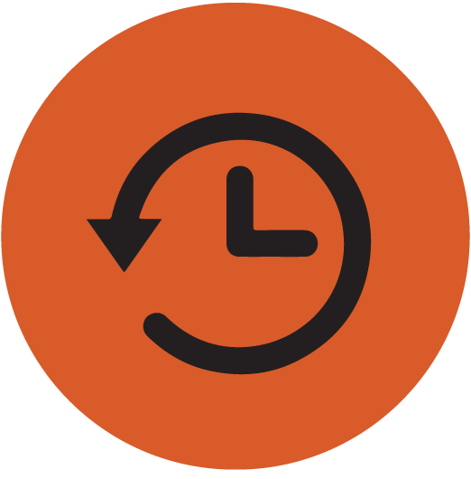

# debounce



> A decorator or higher-order function to prevent repeated calls during the transmitted period of time.
> Automatically bind this.
> Returns a promise.

[](https://badge.fury.io/js/@danieldyachenko%2Fdebounce)

## Table of Contents

- [Quick start](#quick-start)
  - [Install](#install)
  - [Usage](#usage)
    - [Decorator](#decorator)
    - [Higher order function](#higher-order-function)
- [Methods](#methods)
  - [debounce](#debounce)
    - [Params](#params)
    - [Returns](#returns)

## Quick start

### Install

```shell
npm i @danieldyachenko/debounce
```

### Usage

Can be used in two ways:

### Decorator

```typescript
import debounce from '@danieldyachenko/debounce';

class Api {
  
  @debounce(500)
  requestMethod() {
    // do something
  };
}
```

Or you can return the promise:

```typescript
import debounce from '@danieldyachenko/debounce';

class Api {
  
  @debounce(500)
  requestMethod() {
    return Promise.resolve('result');
  };
}

const api = new Api();
api.requestMethod().then(res => console.log(res)) // => result
```

### Higher order function

```typescript
import debounce from '@danieldyachenko/debounce';

const debouncedFn = debounce(500, (arg) => console.log(arg));
debouncedFn('your argument'); // => your argument
```

Or you can return the promise:

```typescript
import debounce from '@danieldyachenko/debounce';

const debouncedFn = debounce(500, (arg) => Promise.resolve(arg));
debouncedFn('your argument').then((res) => console.log(res)); // => your argument
```

## Methods

### debounce

#### Params

- `ms`
  - Type: `number`
  - Description: time out, after which fn will call
- `fn`
  - Type: `function`
  - Description: function that will be called after ms

#### Returns
- `Promise`

## Author

danieldyachenko


